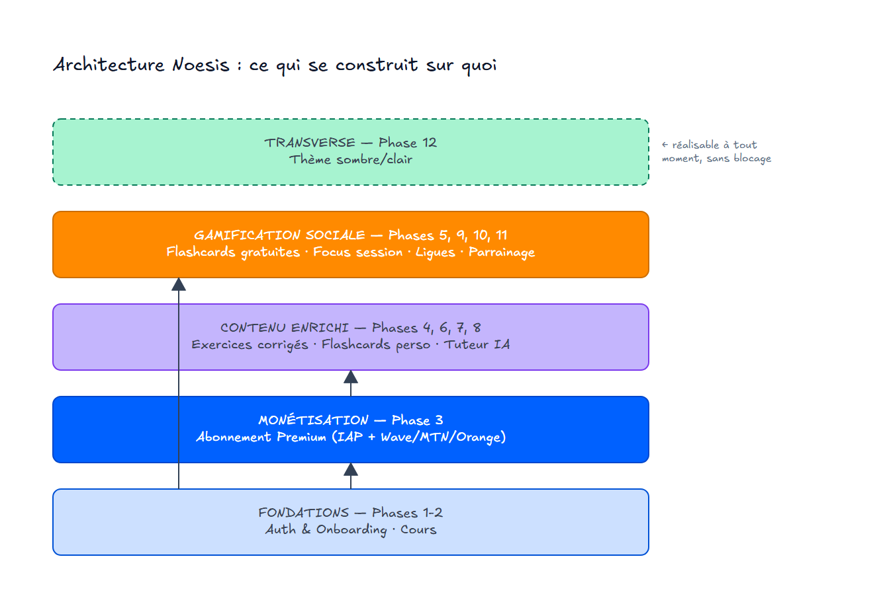
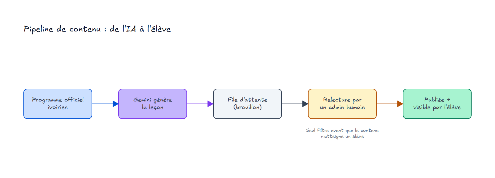
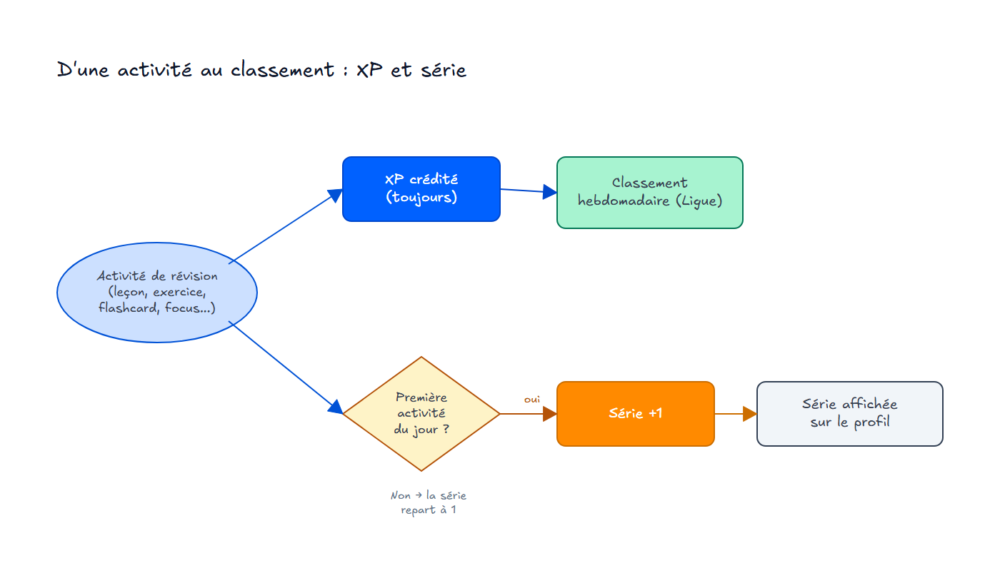

# Plan : App d'éducation Côte d'Ivoire (Noesis)

> PRD source : `docs/PRD.md`

## Décisions architecturales

- **Routes** (app mobile, Expo Router) : `/onboarding/*` → `/login` → `/(tabs)/{accueil,flashcards,ligue,profil}`, avec écrans détail `/course/[id]`, `/subject/[disciplineId]`, `/flashcard-deck/[id]`, `/ai-chat`, `/correct-homework`, `/prepare-homework`, `/focus-session`, `/subscription`, `/settings`. L'outil de relecture de contenu est une webapp d'admin séparée.
- **Schema** (Supabase/Postgres) : `profiles` (classe, série, contact) ; `lessons`/`exercises` (matière, classe, série, statut brouillon/publié) ; `flashcard_decks`/`flashcards`/`srs_reviews` ; `xp_events` ; `streaks` ; `leagues`/`league_memberships` (semaine, palier, classe+série) ; `subscriptions` (provider : iap/wave/mtn/orange) ; `referrals` ; `ai_conversations`/`ai_messages` ; `content_review_queue`
- **Modèles clés** : Profile, Lesson, Exercise, FlashcardDeck, Flashcard, XpEvent, Streak, League, LeagueMembership, Subscription, Referral, AiConversation, ContentReviewItem
- **Auth / autorisation** : Supabase Auth (téléphone OTP ou email). RLS : un élève voit uniquement son propre profil/progression/conversations ; le contenu publié est visible par classe/série correspondante ; le contenu brouillon n'est visible que par le rôle admin.
- **Frontières services tiers** : Gemini appelé uniquement depuis une edge function (jamais côté client) ; un webhook edge function dédié par moyen de paiement (Wave, MTN Money, Orange Money, IAP) alimentant un statut d'abonnement unifié ; fournisseur SMS OTP pour l'auth téléphone.

Les 12 phases se regroupent en 4 couches de dépendance : Focus session, Ligues et Parrainage ne dépendent que des Fondations (Auth/Onboarding + Cours), pas de l'abonnement Premium — seuls Exercices, Flashcards perso et Tuteur IA sont derrière la Monétisation. Le thème sombre/clair est transverse, réalisable à tout moment.

---

## Phase 1 : Auth & Onboarding

**User stories** : US-1, US-2, US-3

### Ce qu'on livre

Un nouvel élève peut créer un compte par téléphone (code SMS) ou par email, traverser un onboarding qui capture sa classe (et sa série s'il est au lycée) et ses objectifs de révision, puis atterrir sur un écran d'accueil fonctionnel. Un élève déjà inscrit peut se reconnecter.

### Critères d'acceptation

- [ ] Un élève peut s'inscrire par téléphone (code SMS) ou par email
- [ ] L'app ne laisse pas continuer sans classe sélectionnée (et série si lycée)
- [ ] Les objectifs de révision saisis sont enregistrés sur le profil
- [ ] Un élève déjà inscrit peut se reconnecter et retrouve son profil

## Bloquée par

- Aucune — démarrable immédiatement

---

## Phase 2 : Cours

**User stories** : US-4, US-5, US-6, US-21 (partiel), US-22, US-23, US-31, US-32, US-33

### Ce qu'on livre

Le pipeline complet de contenu : génération de leçons par IA à partir du programme officiel, file de relecture pour un administrateur, publication. Côté élève : navigation par matière/chapitre, lecture d'une leçon, suivi de progression, gain d'XP et incrémentation de la série quotidienne en terminant une leçon.

Toute activité de révision crédite toujours de l'XP, mais n'incrémente la série que si c'est la première activité du jour ; seul l'XP alimente le classement hebdomadaire de ligue (Phase 10), la série reste un compteur affiché sur le profil.

### Critères d'acceptation

- [ ] Une leçon générée par IA apparaît en statut brouillon, invisible aux élèves
- [ ] Un administrateur peut relire, corriger et publier une leçon depuis l'interface web
- [ ] Un élève ne voit que le contenu publié correspondant à sa classe/série
- [ ] Terminer une leçon incrémente l'XP du jour et la série si c'est la première activité du jour
- [ ] Un élève sans connexion voit un message explicite plutôt qu'un écran vide

## Bloquée par

- Phase 1

---

## Phase 3 : Abonnement Premium

**User stories** : US-27, US-29, US-36

### Ce qu'on livre

Un élève peut souscrire à Premium via achat intégré (store) ou via Wave, MTN Mobile Money ou Orange Money, sur iOS et Android, avec un écran expliquant clairement ce que Premium débloque. Un statut d'abonnement unifié détermine l'accès Premium quel que soit le moyen de paiement utilisé.

### Critères d'acceptation

- [ ] Un élève voit un écran listant les avantages Premium avant de payer
- [ ] Un paiement réussi via n'importe lequel des 4 moyens active le statut Premium sur le compte
- [ ] Un paiement échoué affiche un message d'erreur clair avec possibilité de réessayer
- [ ] Le statut Premium expire correctement à la fin de la période payée

## Bloquée par

- Phase 1

---

## Phase 4 : Exercices corrigés

**User stories** : US-7, US-8, US-21 (continue)

### Ce qu'on livre

Un élève Premium peut faire les exercices liés à une leçon et voir la correction. Un élève gratuit voit les exercices existants mais verrouillés, avec une invitation claire à passer Premium.

### Critères d'acceptation

- [ ] Un élève Premium peut soumettre ses réponses et voir la correction immédiatement
- [ ] Un élève gratuit voit l'exercice mais ne peut pas le compléter, avec un message d'incitation Premium
- [ ] Compléter un exercice corrigé rapporte de l'XP

## Bloquée par

- Phase 2
- Phase 3

---

## Phase 5 : Flashcards gratuites

**User stories** : US-14, US-15, US-21 (continue)

### Ce qu'on livre

Un élève peut réviser les decks de flashcards pré-faits liés à un chapitre, et l'app lui indique automatiquement quelles cartes revoir aujourd'hui selon la répétition espacée.

### Critères d'acceptation

- [ ] Un élève peut ouvrir un deck pré-fait et le réviser carte par carte
- [ ] L'app calcule et affiche les cartes dues aujourd'hui selon leur historique de révision
- [ ] Réviser des flashcards rapporte de l'XP

## Bloquée par

- Phase 2

---

## Phase 6 : Flashcards personnalisées

**User stories** : US-16

### Ce qu'on livre

Un élève Premium peut créer un deck de flashcards personnalisé (question/réponse) et le réviser avec le même moteur de répétition espacée que les decks pré-faits.

### Critères d'acceptation

- [ ] Un élève Premium peut créer, éditer et supprimer ses propres cartes
- [ ] Un élève gratuit voit l'option de création verrouillée, avec invitation Premium
- [ ] Les cartes personnalisées entrent dans le même cycle de répétition espacée que les decks pré-faits

## Bloquée par

- Phase 5
- Phase 3

---

## Phase 7 : Tuteur IA — chat

**User stories** : US-9, US-12, US-13

### Ce qu'on livre

Un élève Premium peut discuter par chat avec le tuteur IA et retrouver l'historique de ses conversations. Un élève gratuit dispose d'un nombre limité d'essais avant d'être invité à passer Premium.

### Critères d'acceptation

- [ ] Un élève Premium peut poser une question texte et recevoir une réponse du tuteur IA
- [ ] Un élève peut rouvrir une conversation précédente depuis l'historique
- [ ] Un élève gratuit voit son compteur d'essais restants et est bloqué une fois épuisé, avec invitation Premium

## Bloquée par

- Phase 1
- Phase 3

---

## Phase 8 : Tuteur IA — devoirs par photo

**User stories** : US-10, US-11, US-35

### Ce qu'on livre

Un élève Premium peut prendre en photo un devoir manuscrit pour le faire corriger, ou un énoncé de devoir pour être guidé dans sa préparation, avec un message clair si la photo est illisible.

### Critères d'acceptation

- [ ] Une photo de devoir manuscrit lisible reçoit une correction détaillée
- [ ] Une photo d'énoncé déclenche un accompagnement guidé, pas la réponse directe
- [ ] Une photo illisible déclenche un message demandant de reprendre la photo, pas une erreur silencieuse

## Bloquée par

- Phase 7

---

## Phase 9 : Focus session

**User stories** : US-17, US-18, US-19, US-20, US-21 (continue)

### Ce qu'on livre

Un élève peut lancer une session de concentration chronométrée. Sur Android, le mode Ne Pas Déranger s'active automatiquement pour la durée choisie ; sur iOS, l'élève est guidé pour activer un Focus Filter dédié. Un résumé (durée, XP) s'affiche à la fin.

### Critères d'acceptation

- [ ] Sur Android, les notifications sont effectivement bloquées pendant la session active
- [ ] Sur iOS, l'élève voit des instructions claires pour activer le Focus Filter avant de démarrer
- [ ] Terminer une session affiche un résumé et crédite l'XP correspondant

## Bloquée par

- Phase 2

---

## Phase 10 : Ligues hebdomadaires

**User stories** : US-24, US-25, US-26, US-34

### Ce qu'on livre

Chaque semaine, un élève voit le classement de sa ligue face aux élèves de sa classe (et série au lycée), organisé en 8 paliers, avec promotion/relégation automatique en fin de semaine. Les groupes trop petits sont fusionnés automatiquement avec un groupe voisin.

### Critères d'acceptation

- [ ] Le classement de la semaine reflète l'XP gagné par chaque élève du groupe
- [ ] En fin de semaine, les élèves en tête sont promus et ceux en fin de classement relégués au palier suivant
- [ ] Un groupe classe+série avec trop peu d'élèves actifs est fusionné avec un groupe voisin
- [ ] Un élève dont la classe/série n'a pas encore de ligue active voit un état vide explicite

## Bloquée par

- Phase 2

---

## Phase 11 : Parrainage

**User stories** : US-28

### Ce qu'on livre

Un élève peut partager son code de parrainage personnel. Quand un filleul l'utilise, parrain et filleul reçoivent chacun un nombre défini de jours de Premium gratuits.

### Critères d'acceptation

- [ ] Chaque élève a un code de parrainage unique et partageable
- [ ] Un nouvel élève peut saisir un code de parrainage lors de son inscription ou plus tard
- [ ] L'utilisation valide d'un code crédite immédiatement des jours Premium au parrain et au filleul

## Bloquée par

- Phase 3

---

## Phase 12 : Thème sombre/clair

**User stories** : US-30

### Ce qu'on livre

Un élève peut basculer entre mode sombre et mode clair depuis les réglages, et l'app respecte ce choix sur tous les écrans déjà livrés.

### Critères d'acceptation

- [ ] Le réglage de thème est accessible et son changement est immédiat
- [ ] Tous les écrans déjà livrés respectent le thème choisi
- [ ] Le choix de thème persiste après redémarrage de l'app

## Bloquée par

- Aucune — transverse, réalisable en parallèle de n'importe quelle phase

---

## Phase 13 : Support via WhatsApp

**User stories** : US-37

### Ce qu'on livre

Un élève peut signaler un problème ou donner un avis en un tap, via un lien qui ouvre WhatsApp avec un message pré-rempli vers le contact support de l'app.

### Critères d'acceptation

- [ ] Un lien "Signaler un problème / donner un avis" est accessible depuis l'app (Profil ou Réglages)
- [ ] Le lien ouvre WhatsApp avec le numéro de support et un message pré-rempli identifiant l'élève
- [ ] Si WhatsApp n'est pas installé sur l'appareil, l'élève voit un message clair plutôt qu'un échec silencieux

## Bloquée par

- Aucune — démarrable immédiatement

---

## Phase 14 : Célébrations (palier de ligue, jalon de série)

**User stories** : US-38

### Ce qu'on livre

Un élève voit un écran de célébration dédié quand il monte de palier de ligue en fin de semaine, ou quand sa série atteint un jalon (7, 30 ou 100 jours consécutifs), plutôt que de simplement constater le changement dans l'interface habituelle.

### Critères d'acceptation

- [ ] Une promotion de palier de ligue déclenche un écran de célébration dédié à la prochaine ouverture de l'app suivant le rollover hebdomadaire
- [ ] Un jalon de série (7, 30 ou 100 jours) déclenche un écran de célébration dédié la première fois qu'il est atteint
- [ ] L'écran de célébration ne réapparaît pas pour un même événement déjà vu

## Bloquée par

- Aucune — démarrable immédiatement
